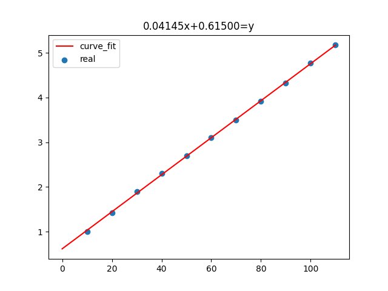

# How To Use
```
from physexp import a
```
### 平均值
```
Avg(a)
```
### 标准差
```
standardDeviation(a)
```
### 测量值的标准偏差
```
standardDeviationOfTheMean(a)
```
### 肖涅维法则剔粗差
```
schauvignianCode(a)
```
### 最小二乘法生成图像
```
x_group = np.array([10,20,30,40,50,60,70,80,90,100,110])
y_group = np.array([1,1.425,1.9,2.3,2.7,3.1,3.5,3.925,4.325,4.775,5.175])
leastSquares(x_group, y_group, 0, 120, 10)
```

返回值为 $Ax + B = 0$ 中的 [A,B]
### 杨氏模量


```
YoungsModulus(72, 67.2, k, Avg(b), 3.7)
```